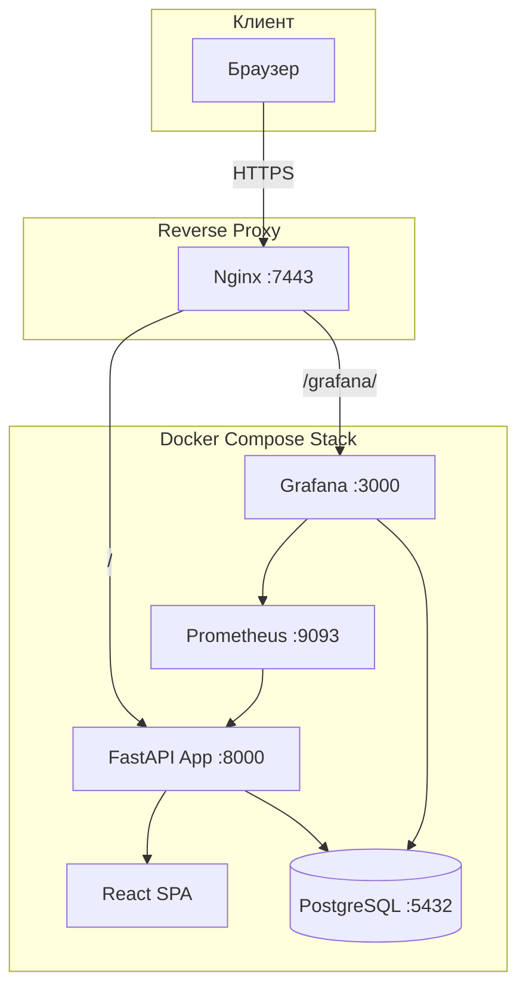

# 🚀 LeetCode Tracker

Интерактивный трекер продуктивности для задач LeetCode. Отслеживайте свой прогресс, ставьте ежемесячные цели и анализируйте статистику решений.

## ✨ Возможности

- 🔄 **Авто-синхронизация**: Автоматически подтягивает ваши решенные задачи с LeetCode
- 📊 **Статистика**: Наглядные графики распределения сложности, ежедневной активности и прогресса
- 🎯 **Цели**: Установка и отслеживание ежемесячных целей по XP
- 🔐 **OAuth**: Безопасный вход через GitHub
- 📈 **Мониторинг**: Встроенные дашборды Grafana для отслеживания состояния системы
- 🐳 **Docker**: Полная контейнеризация для простого развертывания

## 🏗 Архитектура системы



## 🛠 Технологический стек

### Backend
- **Python 3.11**
- **FastAPI**: Современный, быстрый веб-фреймворк
- **SQLAlchemy 2.0**: ORM для работы с базой данных
- **Pydantic**: Валидация данных
- **Alembic**: Миграции базы данных

### Frontend
- **React 18**
- **TypeScript**
- **Vite**: Быстрая сборка
- **Chart.js**: Визуализация данных

### Инфраструктура
- **PostgreSQL 15**: Основная база данных
- **Docker & Docker Compose**: Оркестрация контейнеров
- **Nginx**: Reverse proxy и SSL терминация
- **Prometheus & Grafana**: Сбор и визуализация метрик

## 🏁 Быстрый старт (Локальная разработка)

### Требования
- Docker & Docker Compose
- Git

### Установка

1. **Клонируйте репозиторий:**
   ```bash
   git clone https://github.com/daniil-novel/leetcode-tracker.git
   cd leetcode-tracker
   ```

2. **Настройте окружение:**
   Скопируйте пример конфига и заполните секреты.
   ```bash
   cp .env.example .env
   ```
   
   **Обязательные переменные в .env:**
   ```ini
   # Приложение
   SECRET_KEY=ваш_секретный_ключ
   
   # База данных
   POSTGRES_USER=leetcode_user
   POSTGRES_PASSWORD=leetcode_password
   POSTGRES_DB=leetcode_tracker
   DATABASE_URL=postgresql://leetcode_user:leetcode_password@db:5432/leetcode_tracker
   
   # OAuth (GitHub)
   GITHUB_CLIENT_ID=ваш_client_id
   GITHUB_CLIENT_SECRET=ваш_client_secret
   GITHUB_REDIRECT_URI=http://localhost:8000/auth/callback/github
   ```

3. **Запустите локально:**
   
   **Windows:**
   ```bash
   run_local.bat
   ```
   
   **Linux/macOS:**
   ```bash
   chmod +x run_local.sh
   ./run_local.sh
   ```

4. **Доступ к приложению:**
   - App: `http://localhost:8000`
   - Grafana: `http://localhost:3000` (Логин: `admin` / Пароль: `admin`)

5. **Остановка:**
   
   **Windows:**
   ```bash
   stop_local.bat
   ```
   
   **Linux/macOS:**
   ```bash
   ./stop_local.sh
   ```

## 🚀 Production деплой

### Деплой на сервере

Проект включает скрипт [`deploy.sh`](deploy.sh) для автоматического развертывания на любом Linux сервере с Docker.

1. **Подготовка:** Установите Docker и Git
2. **Настройка:** Клонируйте репозиторий и настройте `.env`
3. **Запуск:**
   ```bash
   chmod +x deploy.sh
   ./deploy.sh
   ```

### Деплой с локальной машины

Используйте скрипт [`deploy_to_vdsina.sh`](deploy_to_vdsina.sh) для деплоя на удаленный сервер:

```bash
chmod +x deploy_to_vdsina.sh
./deploy_to_vdsina.sh
```

### Текущее продакшн окружение (novel-cloudtech.com)

- **URL**: `https://novel-cloudtech.com:7443`
- **IP**: `91.84.104.36`
- **OS**: Ubuntu 22.04 LTS
- **Путь к проекту**: `~/leetcode_tracker_uv`

**Обновление на сервере:**
```bash
cd ~/leetcode_tracker_uv
git pull
./deploy.sh
```

**Просмотр логов:**
```bash
# Логи приложения (FastAPI)
docker compose logs -f app

# Логи базы данных
docker compose logs -f db

# Логи Nginx
tail -f /var/log/nginx/novel-cloudtech.com.error.log
```

**Создание бэкапа базы данных:**
```bash
docker compose exec db pg_dump -U leetcode_user leetcode_tracker > backup_$(date +%F).sql
```

## 🔀 Git Workflow

Проект использует трехветочную стратегию:

- **`main`** - стабильная версия для разработки
- **`deploy`** - production деплой (автоматически синхронизируется с сервером)
- **`features`** - экспериментальные функции и разработка новых возможностей

**Подробнее:** [`docs/GIT_WORKFLOW.md`](docs/GIT_WORKFLOW.md)

## 📜 Доступные скрипты

### Локальная разработка

| Скрипт | Описание |
|--------|----------|
| [`run_local.sh`](run_local.sh) / [`run_local.bat`](run_local.bat) | Запуск приложения локально |
| [`stop_local.sh`](stop_local.sh) / [`stop_local.bat`](stop_local.bat) | Остановка локального приложения |

### Production деплой

| Скрипт | Описание |
|--------|----------|
| [`deploy.sh`](deploy.sh) | Деплой на сервере (запускается на сервере) |
| [`deploy_to_vdsina.sh`](deploy_to_vdsina.sh) | Деплой с локальной машины на удаленный сервер |

### Диагностика

| Скрипт | Описание |
|--------|----------|
| [`check_containers.sh`](check_containers.sh) | Проверка статуса Docker контейнеров |
| [`check_grafana_data.sh`](check_grafana_data.sh) | Проверка данных в Grafana |
| [`check_ports.sh`](check_ports.sh) | Проверка занятых портов |
| [`diagnose_app.sh`](diagnose_app.sh) | Полная диагностика приложения |
| [`diagnose_grafana.sh`](diagnose_grafana.sh) | Диагностика Grafana |

### Тестирование

| Скрипт | Описание |
|--------|----------|
| [`test_leetcode_sync.sh`](test_leetcode_sync.sh) | Тестирование синхронизации с LeetCode |
| [`verify_grafana_data.sh`](verify_grafana_data.sh) | Проверка корректности данных в Grafana |

### Утилиты

| Скрипт | Описание |
|--------|----------|
| [`cleanup_docker.sh`](cleanup_docker.sh) | Очистка неиспользуемых Docker ресурсов |

## 📊 Мониторинг (Grafana + Prometheus)

В проекте настроен полный стек мониторинга:

- **Prometheus**: Собирает метрики с приложения, БД и сервера
- **Grafana**: Визуализирует метрики через дашборды
- **Exporters**: `node_exporter` (метрики хоста), `cadvisor` (метрики контейнеров)

**Доступ к Grafana:**
- Локально: `http://localhost:3000`
- Production: `https://novel-cloudtech.com:7443/grafana/`

**Логин по умолчанию:** `admin` / `admin`

## 📚 Документация

Подробная документация доступна в директории [`docs/`](docs/):

| Документ | Описание |
|----------|----------|
| [`docs/GIT_WORKFLOW.md`](docs/GIT_WORKFLOW.md) | Git workflow и стратегия ветвления |
| [`docs/MIGRATION_GUIDE.md`](docs/MIGRATION_GUIDE.md) | Руководство по миграции базы данных |
| [`docs/VIEW_POSTGRES_DATABASE.md`](docs/VIEW_POSTGRES_DATABASE.md) | Работа с PostgreSQL |
| [`docs/SERVER_INFOv2.md`](docs/SERVER_INFOv2.md) | Информация о сервере и инфраструктуре |
| [`docs/RELEASE_NOTES_v2.0.0.md`](docs/RELEASE_NOTES_v2.0.0.md) | Release notes версии 2.0.0 |

## 📂 Структура проекта

```
leetcode_tracker_uv/
├── leetcode_tracker/      # Backend (FastAPI)
│   ├── routers/           # API endpoints
│   ├── models.py          # SQLAlchemy модели
│   ├── schemas.py         # Pydantic схемы
│   ├── auth.py            # Аутентификация
│   ├── database.py        # Подключение к БД
│   └── main.py            # Точка входа приложения
├── frontend/              # Frontend (React + TypeScript)
│   ├── src/
│   │   ├── components/    # React компоненты
│   │   ├── pages/         # Страницы приложения
│   │   └── context/       # React Context
│   └── package.json
├── grafana/               # Grafana конфигурация
│   ├── provisioning/      # Автоматическая настройка
│   └── prometheus.yml     # Конфигурация Prometheus
├── alembic/               # Миграции БД
│   └── versions/          # История миграций
├── scripts/               # Утилиты
│   ├── migrate_sqlite_to_postgres.py
│   └── export_data.py
├── docs/                  # Документация
├── docker-compose.yml     # Docker Compose конфигурация
├── Dockerfile             # Docker образ (multi-stage build)
├── pyproject.toml         # Python зависимости (uv)
└── README.md              # Этот файл
```

## 📄 Лицензия

Этот проект распространяется под лицензией MIT.
